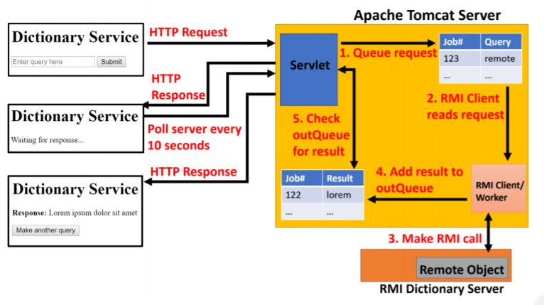
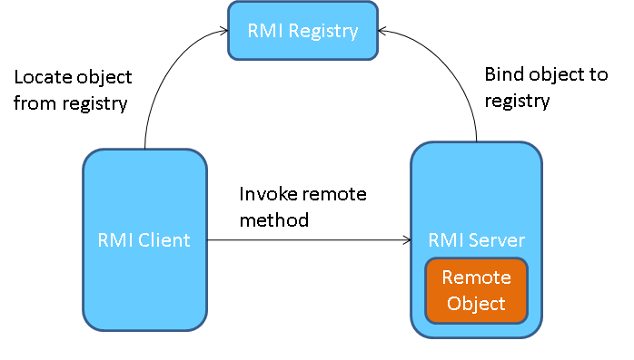

# RMIProject
Distributed Systems Assignment

## [Contents](#contents)
[Introduction](#intro)  
[OverView](#overview)
[Technology](#tech)                     
[How to run Repository](#repo)  
[Conclusion](#con)   
[References](#ref) 

## Introduction 

## OverView 

### The OverView of our Project

You are required to use the Servlet/JSP and Java RMI frameworks to develop a remote, asynchronous dictionary
lookup service. A JSP page should provide users with the ability to specify a string which will be checked
against the dictionary. The HTML form information should be dispatched to a servlet that adds the client request
to an in-queue and then returns a job ID to the web client. The web client should poll the web server periodically
(every 10 seconds) and query if the request has been processed. Client requests in the inQueue should
be periodically removed and processed (every 10 seconds).
The processing of a client request will require a RMI method invocation to a remote object which implements
an interface called DictionaryService. The remote object which implements DictionaryService should check
if the string received exists in the dictionary, and return the dictionary definition of the string if it does exist in
the dictionary, or “String not found” if it does not exist in the dictionary. Once the result of the dictionary lookup
has been computed by the remote object, the returned response should be added to the outQueue on the Tomcat
server and returned to the original web client when they next poll the server. The following diagram depicts the
overall system architecture:

## Technology 

The Technology I used for my project are as follows: JSP(Java Servlet Pages), Java Servlets, Apache Tomcat and RMI(Remote Method Invocation). The IDE I used was Eclipse JEE(Java Enterprise Edition).
Here is a short summary of each.

### JSP

### Java Servlets

A servlet is a Java programming language class that is used to extend the capabilities of servers that host applications accessed by means of a request-response programming model. Although servlets can respond to any type of request, they are commonly used to extend the applications hosted by web servers. For such applications, Java Servlet technology defines HTTP-specific servlet classes.

### Apache Tomcat

The Apache Tomcat® software is an open source implementation of the Java Servlet, JavaServer Pages, Java Expression Language and Java WebSocket technologies and provides a "pure Java" HTTP web server environment in which Java code can run.

### RMI

The Java Remote Method Invocation (RMI) system allows an object running in one Java virtual machine to invoke methods on an object running in another Java virtual machine. RMI provides for remote communication between programs written in the Java programming language.

### Eclipse JEE

Eclipse IDE is an integrated development environment (IDE) used in computer programming, and is the most widely used Java IDE. It contains a base workspace and an extensible plug-in system for customizing the environment. Eclipse is written mostly in Java and its primary use is for developing Java applications, but it may also be used to develop applications in other programming languages via plug-ins. The Eclipse JEE(Java Enterprise Edition) version comes with pre-installed plug-ins which better serves working with databases and web applications. 

## How to run Repositiory 

## Conclusion 

## References 

JSP: [http://flask.pocoo.org/](http://flask.pocoo.org/)
JavaServlets: [https://docs.oracle.com/javaee/5/tutorial/doc/bnafe.html](https://docs.oracle.com/javaee/5/tutorial/doc/bnafe.html)
Apache Tomcat: [http://tomcat.apache.org/](http://tomcat.apache.org/)
RMI: [https://docs.oracle.com/javase/tutorial/rmi/index.html](https://docs.oracle.com/javase/tutorial/rmi/index.html)
Eclipse JEE: [https://www.eclipse.org/](https://www.eclipse.org/)

